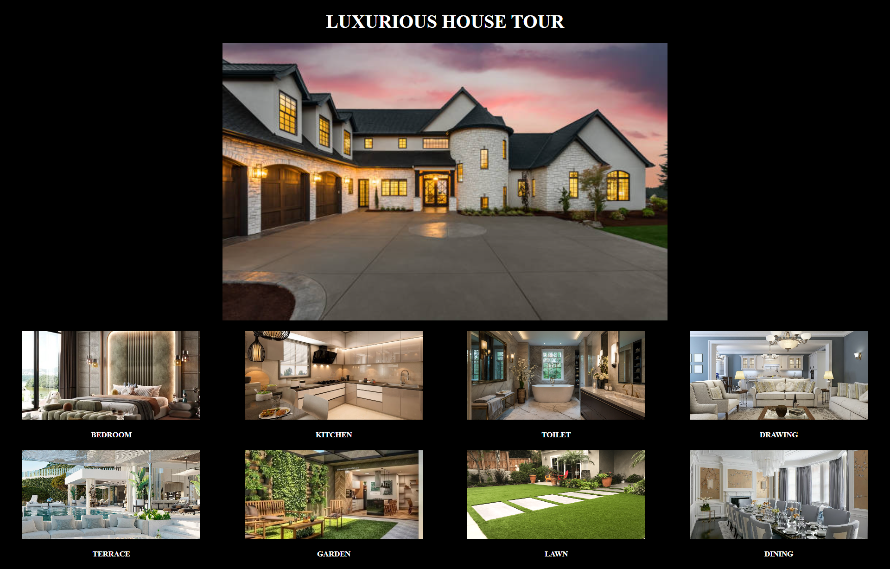

# 🏡 Luxurious 360° Tour

An immersive web application that allows users to virtually explore a luxurious house room-by-room with interactive 360-degree views.

## 🌟 Features

- 🖼️ Central hero section with elegant house image
- 🧭 Clickable room thumbnails for quick access
- 🌐 360° panoramic room view using Three.js and React Three Fiber
- 🔁 Horizontal image slider with smooth navigation
- 📱 Fully responsive design (2-column layout on mobile, 8-column on desktop)
- 🔙 Stylish back button to return from room views

## 🚀 Technologies Used

- ⚛️ React.js (with React Router)
- 💨 Tailwind CSS for styling
- 🌐 @react-three/fiber & drei for 3D 360° experience
- ⚡ Vite for blazing fast setup

## 📸 Live Demo
> *Explore a stunning virtual tour from your browser.*



## 📁 Folder Structure

```
/public
/assets          # 360° images for each room

/src
/components
Home.jsx       # Landing page with thumbnails
RoomView\.jsx   # 360° panoramic view
App.jsx
```

## 🛠️ Installation & Usage

1. **Clone the repository:**
    ```bash
    git clone https://github.com/Rudra-Prasad-Nayak/Luxurious_360_Tour.git
    cd Luxurious_360_Tour
    ```
2. **Install dependencies:**
    ```bash
    npm install
    ```
3. **Run the development server:**
    ```bash
    npm run dev
    ```
4. **Build for production:**
    ```bash
    npm run build
    ```

## 🔗 Connect with Me

* [🌐 GitHub](https://github.com/Rudra-Prasad-Nayak)
* [💼 LinkedIn](https://www.linkedin.com/in/RudraPrasadNayak728/)
* [☕ Buy Me a Coffee](https://buymeacoffee.com/rudraprasa3)

## 🙌 Appreciate My Work?

If you found this project helpful or inspiring:

* ⭐ Drop a **star** on [GitHub](https://github.com/Rudra-Prasad-Nayak/Luxurious_360_Tour)
* ☕ Support me on [Buy Me a Coffee](https://buymeacoffee.com/rudraprasa3)

Your support motivates me to build more cool stuff! 💖
## 📄 License

This project is licensed under the **MIT License**.
See the [LICENSE](./LICENSE) file for full details.


## 💬 Feedback

Feel free to share your thoughts, improvements, or feature ideas! I’d love to hear from you.
